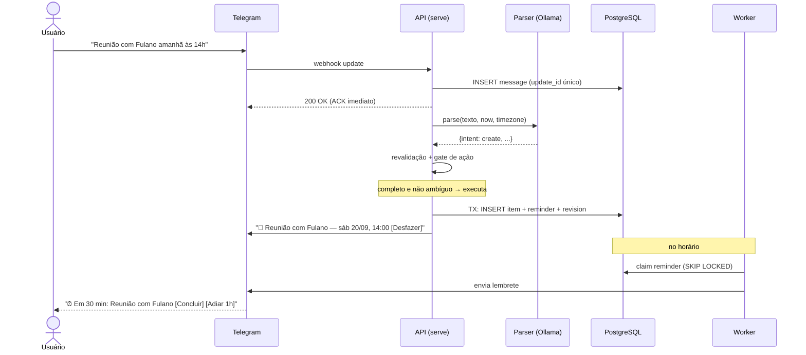
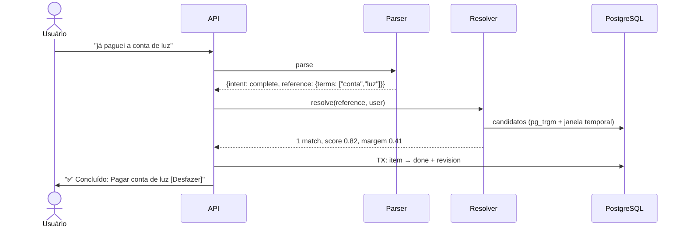

# Noto — Product Requirements Document

| | |
|---|---|
| **Status** | Draft — aprovado para M0 |
| **Versão** | 0.2 |
| **Data** | 2026-09-19 |
| **Autor** | Eduardo Henrique |
| **Stack decidida** | Go · PostgreSQL · Ollama (Cloud → local) · Telegram |

> **Mudança na v0.2** — duas decisões de escopo foram revertidas: (1) comandos em linguagem natural para **concluir, cancelar e editar** entram no MVP; (2) a confirmação **deixa de ser obrigatória** em todo item. A segurança do fluxo migra de *confirmar antes* para *agir e permitir desfazer*. Ver [ADR 0006](./adr/0006-confirmacao-seletiva-e-desfazer.md) e [ADR 0007](./adr/0007-resolucao-de-referencia.md).
>
> **Revisão v0.2.1** — fechamento de lacunas encontradas em revisão dos próprios documentos: intenção `multiple` (§7.2), política de lembrete padrão (§7.6), tratamento de itens sem data (§5.7 e F10), limite de `callback_data` do Telegram (§8.7), transporte e alvo de deploy (§8.8 e [ADR 0008](./adr/0008-transporte-telegram-e-deploy.md)), teto de custo com número (§9) e estratégia de teste ([`testing.md`](./testing.md)).

---

## 1. Visão e problema

Ferramentas de organização pessoal não falham por falta de recurso. Falham por **custo de entrada**. O usuário abandona o app porque registrar um compromisso custa mais esforço do que segurá-lo na cabeça por mais cinco minutos — e então ele esquece.

O fluxo padrão para capturar um compromisso hoje:

1. desbloquear o celular
2. abrir o app
3. tocar em "adicionar"
4. digitar título
5. escolher data no date picker
6. escolher hora
7. configurar lembrete
8. salvar

São oito passos para registrar uma informação que o usuário conseguiria falar em quatro segundos.

O **Noto** aposta que a captura precisa custar **uma frase**, e que a estruturação é problema do sistema, não do usuário:

> "Amanhã tenho uma reunião com o Fulano sobre o orçamento."
>
> "Me lembra de pagar a conta sexta às 14h."
>
> "Já paguei a conta."
>
> "Cancela a reunião de amanhã."

A mesma tese vale para o outro lado do ciclo: **fechar** um item também precisa custar uma frase, não uma navegação.

### 1.1 Posicionamento

O Noto é uma ferramenta de **captura e manutenção sem atrito**, não de gestão de projetos.

Ele não compete com Todoist, Notion ou Linear. Ele compete com o bloco de notas, com o "mensagem salva para mim mesmo" no Telegram, e com a memória do usuário — que é o concorrente que mais vence hoje, e o que mais falha.

Essa distinção governa todo o escopo deste documento. Sempre que houver tensão entre "mais poder" e "menos atrito", o Noto escolhe menos atrito.

### 1.2 Contexto do projeto

Projeto de aprendizado e portfólio, conduzido com disciplina de produto real. Isso tem uma consequência concreta no escopo: decisões técnicas que geram aprendizado relevante (sistemas distribuídos, observabilidade, avaliação de LLM) têm peso positivo na escolha, desde que não comprometam a simplicidade da solução. Decisões que apenas adicionam superfície operacional sem aprendizado — ou sem necessidade — são recusadas.

---

## 2. Personas e job-to-be-done

### 2.1 Persona primária — "o capturador em movimento"

Profissional individual, 25–45 anos, já vive no Telegram. Mistura compromissos pessoais e de trabalho no mesmo fluxo mental. Hoje usa "Mensagens Salvas" do Telegram como caixa de entrada informal — e nunca mais revisita.

Já tentou dois ou três apps de produtividade. Abandonou todos na segunda semana.

**Job-to-be-done:**

> Quando lembro de um compromisso enquanto estou fazendo outra coisa, quero registrá-lo — e depois fechá-lo — em segundos, sem mudar de contexto e sem precisar navegar até ele.

**Critério de sucesso na cabeça do usuário:** "eu falei, e sei que vai aparecer na hora certa. E quando acabou, eu falo de novo e some."

### 2.2 Persona secundária (v2+) — "o revisor"

O mesmo usuário, num momento diferente: sentado, querendo ver o panorama da semana e reorganizar. Atendido no MVP de forma mínima (`/hoje`, `/semana`, `/pendentes`).

### 2.3 Não-personas no MVP

- Times e uso colaborativo
- Agenda compartilhada
- Quem precisa de hierarquia de projetos, tags, prioridades ou kanban

---

## 3. Princípios de produto

Critério de desempate em decisões de design ao longo de todo o projeto.

1. **Uma frase basta.** Todo formulário é uma falha de design que não conseguimos evitar ainda. Isso vale tanto para criar quanto para concluir, cancelar e editar.
2. **Nunca perder a intenção do usuário.** Mesmo quando o parser erra ou o modelo cai, a mensagem bruta é preservada e recuperável. O usuário nunca fala com o vazio.
3. **Agir, e deixar desfazer.** Perguntar "tem certeza?" a cada ação transfere ao usuário um custo que é nosso. O sistema age, mostra claramente o que fez, e torna o retorno trivial. Confirmação prévia só onde a ambiguidade impede agir.
4. **Nada é destruído.** Cancelar muda estado, não apaga linha. Toda mutação guarda o estado anterior. A única deleção real do sistema é `/esquecer`.
5. **O canal é acessório.** Telegram é o primeiro canal, não a arquitetura. O domínio não sabe o que é Telegram.
6. **Toda interpretação é rastreável.** Dado um item, deve ser possível reconstruir a mensagem original, o prompt, o modelo e a saída bruta que o geraram — e todo o histórico de mudanças desde então.

> O Princípio 3 substitui o "confirmar é barato; errar em silêncio é caro" da v0.1. O raciocínio da troca está no [ADR 0006](./adr/0006-confirmacao-seletiva-e-desfazer.md): *desfazer* entrega a mesma proteção que *confirmar*, cobrando o custo apenas de quem errou, em vez de cobrar de todo mundo, o tempo todo.

---

## 4. Escopo do MVP

### 4.1 Dentro do escopo

| # | Funcionalidade | Descrição |
|---|---|---|
| F1 | **Onboarding** | `/start` apresenta o bot e captura o fuso horário (default `America/Sao_Paulo`, confirmado explicitamente). Sem fuso não há produto — todo o valor depende de acertar "amanhã às 14h". |
| F2 | **Criar por linguagem natural** | Mensagem livre em PT-BR → item estruturado. Três tipos: `task`, `event`, `reminder`. |
| F3 | **Concluir, cancelar e editar por linguagem natural** | "já paguei a conta", "cancela a reunião de amanhã", "muda o dentista para quinta às 10h". Requer resolução de referência (§7.4). |
| F4 | **Execução direta com desfazer** | Quando a interpretação está completa e a referência é única, o Noto **executa** e responde com o resultado e um botão **Desfazer**. Sem pergunta prévia. |
| F5 | **Confirmação seletiva** | Pergunta apenas quando não dá para agir: campo obrigatório ausente, ou referência ambígua. No primeiro caso pergunta **só o campo faltante**; no segundo, apresenta os candidatos. |
| F6 | **Entrega de lembretes** | Worker entrega o lembrete no Telegram no horário, com botões de **Concluir** e **Adiar 1h**. |
| F7 | **Consulta** | `/hoje`, `/semana`, `/pendentes` — listagens determinísticas, cada item com botão de concluir. |
| F8 | **Histórico e reversão** | Toda mutação guarda o estado anterior, o que viabiliza o desfazer e a auditoria. |
| F9 | **Revisão de itens sem data** | Itens sem `starts_at` não disparam lembrete e não aparecem em `/hoje`. Um digest semanal e um nudge por acúmulo impedem que virem buraco negro (§5.7). |
| F10 | **Privacidade** | `/esquecer` apaga todos os dados do usuário. Retenção automática de mensagens brutas. |

### 4.2 Fora do escopo, com justificativa

| Excluído | Por quê | Quando volta |
|---|---|---|
| **Recorrência** (`RRULE`) | Maior salto de complexidade por unidade de valor no backlog: o parser precisa extrair padrões temporais compostos ("toda segunda, menos em feriado") e o scheduler precisa materializar ocorrências, tratar exceções e lidar com mudança de fuso. | v2 |
| **Sync com Google Calendar / CalDAV** | Integração bidirecional traz conflito de escrita, reconciliação e OAuth. Nada disso valida a tese central. | v2+ |
| **Outros canais** (WhatsApp, web, app) | O valor de um segundo canal é validar a fronteira do domínio. Essa fronteira já está desenhada (§8.2); exercitá-la agora é pagar o custo antes de ter o produto. | v2 |
| **Anexos, times, tags, prioridades, subtarefas** | Superfície de gestão de projetos. Contradiz §1.1. | Fora do roadmap |

---

## 5. Fluxos de usuário

### 5.1 Criação — caminho direto



O item já existe quando a resposta chega. O usuário lê o resultado, não uma proposta. Se estiver errado, um toque reverte.

### 5.2 Conclusão e cancelamento por linguagem natural



O modelo **nunca escolhe qual registro alterar**. Ele descreve a referência; quem resolve é código determinístico com acesso ao banco (§7.4 e [ADR 0007](./adr/0007-resolucao-de-referencia.md)).

### 5.3 Referência ambígua — o caso em que se pergunta

Entrada: *"cancela a reunião"* — o usuário tem três reuniões nos próximos dias.

O resolver retorna múltiplos candidatos sem margem suficiente. Aqui o sistema **não age**:

> Qual reunião?
> `[ Fulano — sáb 14:00 ]`
> `[ Equipe — seg 09:00 ]`
> `[ Cliente — ter 15:30 ]`
> `[ Nenhuma dessas ]`

Este é o único tipo de confirmação obrigatória do MVP, e ela existe porque é impossível agir sem ela — não por cautela.

### 5.4 Campo ausente

Entrada: *"preciso entregar o relatório segunda"*

Parser resolve a data e sinaliza `missing: ["starts_at_time"]`. O bot pergunta **só a hora**:

> 📋 Entregar o relatório — segunda, 22/09
> Que horas? `[ Dia inteiro ]`

Não se pede de novo o título nem a data. Cada pergunta ao usuário é um imposto; cobra-se o mínimo.

### 5.5 Falha de parse

JSON inválido duas vezes, ou modelo indisponível. O bot **não** responde "não entendi":

> Não consegui interpretar isso agora. Guardei como tarefa sem data:
> 📋 *"Preciso entregar o relatório segunda"*
> `[ Definir data ]` `[ Descartar ]`

A mensagem bruta vira o título. O Princípio 2 é inviolável.

### 5.6 Desfazer

O botão **Desfazer** carrega o `revision_id` da mutação. Ao ser tocado, o sistema aplica o estado anterior registrado naquela revisão e grava uma nova revisão do tipo `reverted` — desfazer é uma operação auditada, não um apagamento.

Se o item tiver sofrido outra mudança depois daquela revisão, o botão não sobrescreve em silêncio:

> Esse item mudou depois dessa ação. Estado atual:
> 📅 Dentista — qui 10:00
> `[ Ver histórico ]`

### 5.7 Itens sem data — o caminho que não pode virar buraco negro

Um item sem `starts_at` não dispara lembrete e não aparece em `/hoje` nem em `/semana`. Ele existe apenas em `/pendentes`, que depende de o usuário lembrar de abrir.

Isso é um problema, e é um problema grave justamente porque esse é o destino do **fallback de parse** (§5.5): a intenção ficaria preservada no banco e perdida na vida do usuário. Cumpriria o Princípio 2 na letra e o violaria na prática, exatamente no caminho que existe para quando o sistema errou.

Duas válvulas, ambas passivas — o usuário não precisa lembrar de nada:

**Digest semanal.** Domingo às 18h no fuso do usuário, se houver itens sem data pendentes:

> Você tem 4 tarefas sem data:
> `[ Pagar IPVA ]` `[ Entregar relatório ]` `[ +2 ]`
> Toque para agendar, ou ignore.

**Nudge por acúmulo.** Ao criar um item sem data quando já há 5 ou mais, o Noto acrescenta uma linha à resposta — sem mensagem separada, sem interromper o fluxo:

> 📋 Comprar leite `[Desfazer]`
> *(você tem 6 tarefas sem data — `/pendentes`)*

Ambos são desligáveis. O digest é agendado pelo mesmo scheduler dos lembretes, sem mecanismo novo: uma linha em `reminders` com `item_id` nulo e um tipo `digest`.

---

## 6. Modelo de domínio

### 6.1 Decisão: entidade única com discriminador

Tarefas, eventos e lembretes são **uma tabela `items`** com um campo `type`, não três tabelas.

Os três compartilham praticamente os mesmos campos, e a fronteira entre eles é fluida na fala real. "Tenho que ligar pro dentista às 15h" é tarefa ou compromisso? A resposta não importa para o usuário, e um modelo que exige essa resposta cedo cria migração dolorosa quando descobrirmos que estava errada.

### 6.2 Esquema

```
users
  id               uuid pk
  telegram_user_id bigint UNIQUE NOT NULL
  timezone         text NOT NULL          -- IANA, ex. "America/Sao_Paulo"
  locale           text NOT NULL DEFAULT 'pt-BR'
  created_at       timestamptz

messages                                   -- toda entrada bruta, imutável
  id                  uuid pk
  user_id             uuid fk
  telegram_update_id  bigint UNIQUE        -- idempotência de webhook
  chat_id             bigint
  raw_text            text
  received_at         timestamptz

pending_questions                          -- só existe quando o sistema NÃO pôde agir
  id            uuid pk
  user_id       uuid fk
  message_id    uuid fk
  kind          question_kind              -- missing_field | ambiguous_reference
  parsed        jsonb
  candidates    jsonb                      -- itens ofertados, quando ambíguo
  expires_at    timestamptz
  status        question_status            -- open | answered | expired | abandoned

items
  id                uuid pk
  user_id           uuid fk
  type              item_type              -- task | event | reminder
  title             text NOT NULL
  description       text
  starts_at         timestamptz            -- sempre UTC
  ends_at           timestamptz
  all_day           boolean NOT NULL DEFAULT false
  location          text
  status            item_status            -- pending | done | cancelled
  source_message_id uuid fk                -- rastreabilidade
  created_at        timestamptz
  updated_at        timestamptz
  INDEX gin (title gin_trgm_ops)           -- resolução de referência

item_revisions                             -- habilita desfazer e auditoria
  id                uuid pk
  item_id           uuid fk
  action            revision_action        -- created | updated | completed
                                           -- | cancelled | reverted
  before            jsonb                  -- null em created
  after             jsonb
  source_message_id uuid fk
  created_at        timestamptz
  INDEX (item_id, created_at DESC)

reminders                                  -- também é a fila do scheduler
  id            uuid pk
  kind          reminder_kind              -- item | digest
  item_id       uuid fk NULL               -- nulo quando kind = digest
  user_id       uuid fk                    -- alvo do digest
  remind_at     timestamptz NOT NULL
  status        reminder_status            -- pending | claimed | sent | failed
  attempts      int NOT NULL DEFAULT 0
  locked_until  timestamptz
  INDEX (status, remind_at)

outbox                                     -- toda saída, com retry
  id              uuid pk
  user_id         uuid fk
  chat_id         bigint
  dedup_key       text UNIQUE              -- idempotência de envio
  payload         jsonb
  status          outbox_status            -- pending | sent | failed
  attempts        int NOT NULL DEFAULT 0
  next_attempt_at timestamptz

parse_runs                                 -- rastreabilidade e eval
  id             uuid pk
  message_id     uuid fk
  model          text
  prompt_version text
  schema_version text
  latency_ms     int
  tokens_in      int
  tokens_out     int
  raw_output     jsonb
  valid          boolean
  error          text
  created_at     timestamptz

resolutions                                -- eval e observabilidade do resolver
  id              uuid pk
  message_id      uuid fk
  reference       jsonb                    -- o que o modelo descreveu
  candidate_count int
  top_score       numeric
  margin          numeric                  -- score do 1º menos o do 2º
  chosen_item_id  uuid                     -- null quando foi perguntar
  outcome         resolution_outcome       -- acted | disambiguated | not_found
  created_at      timestamptz
```

### 6.3 Por que `item_revisions` existe

É o que torna o Princípio 3 possível. Sem estado anterior guardado, "desfazer" seria adivinhação, e a decisão de agir sem confirmar seria imprudente em vez de projetada.

Ela também entrega, de graça, o histórico por item — que responde "por que esse compromisso está às 16h se eu marquei às 14h?" sem arqueologia.

### 6.4 Por que `parse_runs` e `resolutions` existem

Não são tabelas de log. São infraestrutura de produto.

`parse_runs` atende o Princípio 6 e é o que permite **trocar de modelo com evidência em vez de fé**: quando chegar a hora de avaliar um SLM local, a comparação será contra produção real registrada.

`resolutions` faz o mesmo para o componente novo e mais arriscado do MVP. Ela responde às três perguntas que decidem se a resolução de referência está calibrada: com que frequência erramos o alvo, com que frequência perguntamos sem precisar, e com que frequência não achamos nada que existia. Sem ela, os limiares do §7.4 seriam chute permanente.

Cadeia de rastreabilidade completa:
`item.source_message_id → messages.id ← parse_runs.message_id`, `← resolutions.message_id`, e `item_revisions.item_id → items.id`.

---

## 7. Contrato do parser e resolução de referência

### 7.1 Fronteira

O domínio define a interface; o Ollama é um detalhe atrás dela.

```go
// internal/core/ports
type Parser interface {
    Parse(ctx context.Context, in ParseInput) (ParseOutput, error)
}

type Resolver interface {
    Resolve(ctx context.Context, userID uuid.UUID, ref Reference) (Resolution, error)
}
```

Nenhum tipo do pacote `ollama` atravessa essa fronteira. O `Resolver` não chama LLM nenhum.

### 7.2 Saída estruturada

`POST /api/chat` com o campo `format` contendo um JSON Schema — structured output nativo do Ollama. Schema e struct Go são a mesma fonte de verdade, versionados via `schema_version` (agora `v2`).

**Criação:**

```json
{
  "intent": "create",
  "entity_type": "meeting",
  "title": "Reunião com Fulano",
  "description": "Conversar sobre orçamento",
  "starts_at": "2026-09-20T14:00:00-03:00",
  "location": null,
  "remind_at": null,
  "recurrence": null,
  "missing": [],
  "needs_clarification": false
}
```

**Mutação de item existente:**

```json
{
  "intent": "cancel",
  "reference": {
    "terms": ["reunião", "Fulano"],
    "entity_type": "meeting",
    "time_hint": { "kind": "day", "date": "2026-09-20" },
    "status_hint": "pending"
  },
  "changes": null,
  "needs_clarification": false
}
```

Para `intent: "update"`, `changes` carrega apenas os campos a alterar (`{"starts_at": "2026-09-25T10:00:00-03:00"}`).

Intenções suportadas: `create`, `complete`, `cancel`, `update`, `query`, `multiple`, `unknown`.

**`multiple` — uma frase, vários pedidos.** "Amanhã tenho dentista e preciso pagar o IPVA" contém dois itens. O schema devolve **um** objeto por chamada, e essa é uma decisão deliberada: aceitar lote exigiria confirmação em lote, desfazer em lote e resolução de referência em lote — complexidade desproporcional ao MVP. Em vez disso o modelo classifica a frase como `multiple`, devolve os fragmentos detectados, e o Noto responde:

> Entendi dois pedidos aí. Manda separado que eu registro os dois:
> • *"amanhã tenho dentista"*
> • *"preciso pagar o IPVA"*

Os fragmentos vêm prontos para o usuário copiar. É uma limitação declarada, não um erro silencioso — que é a diferença entre um sistema honesto e um que finge.

`recurrence` existe no contrato mas é **sempre ignorado** no MVP — o campo está lá para que o schema não mude na v2, e para que os dados de produção mostrem com que frequência usuários tentam recorrência.

### 7.3 Robustez

O modelo é tratado como **componente não confiável**:

- **Contexto temporal explícito.** O prompt recebe `now` no fuso do usuário e o nome IANA. Não se assume que o modelo saiba que dia é hoje.
- **Revalidação em Go.** Data no passado, a mais de dois anos, ou offset inconsistente com o fuso → rejeitada, independentemente do que o modelo afirmou.
- **Um retry com o erro realimentado.** Duas falhas → fluxo 5.5.
- **O modelo nunca emite identificadores.** Ele descreve; quem resolve é o §7.4. Um LLM que pudesse devolver um `item_id` poderia alucinar um alvo para uma operação destrutiva.

### 7.4 Resolução de referência

Código determinístico, sem LLM. Detalhado no [ADR 0007](./adr/0007-resolucao-de-referencia.md).

**Candidatos.** Itens do usuário, filtrados por status compatível com a ação (não se conclui o que já está concluído) e por janela temporal: se há `time_hint`, ±1 dia em torno dela; senão, próximos 14 dias mais os últimos 2.

**Pontuação.**

```
score = 0.50 × similaridade_de_título   (pg_trgm)
      + 0.30 × proximidade_temporal
      + 0.20 × recência_de_criação
```

**Decisão.**

| Condição | Ação |
|---|---|
| `top_score ≥ 0.60` **e** margem sobre o 2º `≥ 0.15` | age, responde com resultado e **Desfazer** |
| candidatos existem, mas sem margem | pergunta (fluxo 5.3) |
| nenhum candidato | informa e oferece `/pendentes` |

Os três números acima são **limiares iniciais, não verdades**. Existem para ser calibrados contra a tabela `resolutions` e o eval set, e a expectativa é que mudem.

### 7.5 Política de ação — quando o Noto age sozinho

| Intenção | Condição | Comportamento |
|---|---|---|
| `create` | interpretação completa e não ambígua | **executa** + Desfazer |
| `create` | falta campo obrigatório | pergunta só o campo (5.4) |
| `complete` | referência resolvida com margem | **executa** + Desfazer |
| `cancel` | referência resolvida com margem | **executa** (soft) + Desfazer |
| `update` | referência resolvida com margem | **executa** + Desfazer (com snapshot) |
| qualquer | referência ambígua | desambigua (5.3) |
| qualquer | referência não encontrada | informa, oferece `/pendentes` |
| qualquer | parse inválido 2× | fallback bruto (5.5) |
| `multiple` | — | informa a limitação e devolve os fragmentos (§7.2) |
| `unknown` | — | pede reformulação, preserva a mensagem |

Cada linha "executa" é governada por um flag de configuração **por intenção**. Se `undo_rate` de uma intenção subir acima do limite aceitável, aquela intenção volta a confirmar previamente sem mudança de código — ver §10 e [ADR 0006](./adr/0006-confirmacao-seletiva-e-desfazer.md).

### 7.6 Política de lembrete padrão

Quando o usuário não pede lembrete explicitamente — o caso comum — o Noto precisa decidir sozinho se cria um, e quando. Sem essa regra, `remind_at: null` significaria "nenhum lembrete nunca", e o produto entregaria agenda sem aviso, que é metade do valor.

| Situação | Lembrete criado |
|---|---|
| `event` com hora | 30 min antes |
| `task` com hora | no horário |
| `task` só com data | 9h daquele dia, no fuso do usuário |
| `reminder` explícito | exatamente quando pedido |
| qualquer item sem data | nenhum — tratado por §5.7 |

Se o usuário pediu lembrete explicitamente (`remind_at` preenchido), a política não se aplica: o pedido vence o default, sempre.

Os offsets são configuráveis por usuário na v2. No MVP são constantes, e estão aqui — e não espalhados pelo código — porque são **regra de produto**, não detalhe de implementação: mudá-los muda o que o usuário sente.

---

## 8. Arquitetura

### 8.1 Forma

Monólito modular em Go, **binário único com dois modos de execução**:

```
noto serve     # HTTP: webhook do Telegram
noto worker    # loops: scheduler de lembretes + despachante de outbox
noto migrate   # migrations
```

Os dois modos já são processos separados no Compose, comunicando-se apenas pelo Postgres. Promovê-los a deploys independentes — ou escalar o worker horizontalmente — **não exige mudança de código**.

### 8.2 Camadas

```
cmd/noto/                 entrypoint e subcomandos

internal/
  core/                   domínio puro — zero dependências de infra
    item/                 entidade, invariantes, transições de status
    revision/             snapshot, reversão, histórico
    resolve/              pontuação e política de decisão de referência
    timex/                resolução temporal, fusos, janelas
    ports/                interfaces: Parser, Resolver, Notifier, Repos, Clock

  app/                    casos de uso, orquestração, transações
    ingest_message.go     parse → roteamento por intenção
    create_item.go
    mutate_item.go        complete · cancel · update
    answer_question.go    resposta a campo ausente ou desambiguação
    undo_revision.go
    dispatch_reminder.go
    list_agenda.go

  adapters/
    telegram/             webhook + sender — único lugar que conhece Telegram
    ollama/               implementa ports.Parser
    postgres/             repos (sqlc), resolver, fila, outbox
    otel/                 instrumentação

  platform/               config, slog, servidor HTTP, migrations
```

A pontuação e a política de decisão do resolver vivem em `core/resolve` — é regra de negócio. O adapter Postgres fornece apenas os candidatos e a similaridade de texto. Assim a calibragem dos limiares é testável sem banco.

**Regra de dependência:** `core` não importa nada de `adapters`. Garantida por teste de arquitetura no CI — falha se `internal/core/...` importar `telegram`, `ollama` ou `pgx`. O Princípio 5 vira verificação automatizada, não boa intenção.

### 8.3 Stack

| Camada | Escolha | Motivo |
|---|---|---|
| HTTP | `net/http` + `ServeMux` (Go 1.22+) | Roteamento com método e path params já é stdlib |
| Banco | PostgreSQL 16 + `pg_trgm` | Store, fila, outbox e similaridade de texto na mesma peça |
| Acesso a dados | `pgx` + `sqlc` | SQL à mão, structs Go gerados e tipados. Sem ORM |
| Migrations | `goose` | Simples, versionado, embutível no binário |
| Telegram | `go-telegram/bot` | API moderna, sem dependências transitivas pesadas |
| LLM | Ollama (`/api/chat` + `format`) | Contrato idêntico cloud e local |
| Logs | `log/slog` | Stdlib, JSON estruturado |
| Traces/métricas | OpenTelemetry | Padrão aberto, sem lock-in |

`pg_trgm` é extensão nativa do Postgres. A alternativa seria indexação de texto em processo separado — mais uma peça de infraestrutura para um problema que o banco já resolve nesta escala.

### 8.4 Fila e entrega — sem broker

Não há Redis, RabbitMQ ou Kafka no MVP. O Postgres é a fila.

```sql
UPDATE reminders r
SET status = 'claimed',
    locked_until = now() + interval '2 minutes',
    attempts = attempts + 1
WHERE r.id IN (
    SELECT id FROM reminders
    WHERE status = 'pending' AND remind_at <= now()
    ORDER BY remind_at
    FOR UPDATE SKIP LOCKED
    LIMIT 50
)
RETURNING r.*;
```

`SKIP LOCKED` permite N workers concorrentes sem coordenação externa e sem entrega dupla. Status `claimed` com `locked_until` no passado é trabalho órfão de worker morto, recuperado pelo tick seguinte.

**Saída pela outbox.** Toda mensagem ao usuário é gravada na `outbox` dentro da mesma transação que muda o estado do domínio, e enviada depois pelo despachante. Isso elimina a classe de bug "o banco falhou mas a mensagem já foi enviada" — e o inverso.

A semântica é **at-least-once com deduplicação na borda**: `dedup_key` único garante que reentrega não vira mensagem duplicada. Efeito exactly-once do ponto de vista do usuário, com uma peça de infra a menos. Ver [ADR 0003](./adr/0003-postgres-como-fila.md).

**Idempotência de entrada:** `messages.telegram_update_id` é `UNIQUE`. O Telegram reentrega webhooks sem ACK; a reentrega não duplica ação — o que importa muito mais agora que a ação é executada sem confirmação.

### 8.5 Transacionalidade das mutações

Toda mutação de item é uma transação única cobrindo: mudança em `items`, inserção em `item_revisions` e inserção em `outbox`. Não existe estado intermediário onde o item mudou mas não há como desfazer, ou onde o usuário foi avisado de algo que não aconteceu.

### 8.6 Tempo e fusos

- Banco armazena **sempre** `timestamptz` em UTC.
- Fuso IANA por usuário. Toda renderização e todo cálculo de "hoje" acontecem nesse fuso.
- O parser recebe o `now` convertido e devolve ISO-8601 com offset explícito.
- `Clock` injetável — nada de `time.Now()` espalhado pelo domínio.

Ver [ADR 0005](./adr/0005-modelo-temporal-e-timezone.md).

### 8.7 Limites do canal — `callback_data`

O Telegram limita `callback_data` a **64 bytes**. Isso não é detalhe cosmético: é restrição de desenho que atinge os dois mecanismos centrais do MVP.

| Uso | Formato | Bytes |
|---|---|---|
| Desfazer | `u:<revision_uuid>` | 38 — cabe |
| Concluir da listagem | `d:<item_uuid>` | 38 — cabe |
| **Desambiguação** | `q:<question_uuid>:<item_uuid>` | **75 — estoura** |

A desambiguação precisaria carregar a pergunta *e* o item escolhido. A solução é não carregar o item: a `pending_question` já guarda os candidatos ordenados em `candidates`, então o botão transporta apenas o **índice ordinal**:

```
q:<question_uuid>:2      → 40 bytes
```

Como efeito colateral desejável, isso impede que um `callback_data` forjado aponte para um item arbitrário do banco — o índice só pode referenciar o que aquela pergunta ofereceu. A validação de posse do item deixa de depender de checagem e passa a ser estrutural.

Todo `callback_data` é validado contra o `user_id` da callback query antes de qualquer ação.

### 8.8 Transporte e ambiente

O webhook do Telegram exige **HTTPS público com certificado válido**, o que tornaria impossível rodar o projeto localmente sem túnel. O adapter suporta os dois transportes, escolhidos por configuração:

| Ambiente | Transporte |
|---|---|
| Desenvolvimento | long polling (`getUpdates`) |
| Produção | webhook + `secret_token` |

A fronteira fica no adapter: ambos os transportes produzem o mesmo `Update` e chamam o mesmo caso de uso. Nada acima do adapter sabe qual está em uso.

Isso destrava o M1 — `docker compose up` e um token de bot bastam para desenvolver, sem ngrok e sem domínio. Ver [ADR 0008](./adr/0008-transporte-telegram-e-deploy.md).

---

## 9. Requisitos não-funcionais

| Requisito | Alvo | Como se mede |
|---|---|---|
| ACK do webhook | p95 < 400 ms | Parse é assíncrono; o ACK não espera o LLM |
| Resposta de ação | p95 < 4 s | Do recebimento à confirmação do que foi feito |
| Resolução de referência | p95 < 150 ms | Query indexada; não deve dominar a latência |
| Precisão de lembrete | p95 < 30 s de desvio | `reminder_delivery_lag` |
| Durabilidade | Reinício não perde lembrete | Todo estado está no Postgres |
| Reversibilidade | 100% das mutações desfazíveis | Toda mutação grava `item_revisions` |
| Disponibilidade | Melhor esforço, single-node | Sem SLA formal no MVP |
| Custo de inferência | ≤ 20 M tokens/mês, alarme em 70% | Tokens somados de `parse_runs` |
| Abuso por usuário | ≤ 100 parses/dia por usuário | Contagem em `parse_runs` |

### 9.1 De onde sai o teto

Conta de guardanapo, para o teto ser um número defensável em vez de um palpite:

```
prompt (sistema + few-shot)      ~ 350 tokens
mensagem do usuário              ~  30 tokens
saída estruturada                ~ 150 tokens
                                 ─────────────
por parse                        ~ 530 tokens

50 usuários × 15 mensagens/dia   =  750 parses/dia
× 30 dias                        =  22.500 parses/mês
× 530 tokens                     ≈  12 M tokens/mês
```

O teto de 20 M dá folga de ~60% sobre a projeção, o que cobre crescimento e retentativas sem virar surpresa na fatura. O limite de 100 parses/dia por usuário é proteção contra laço acidental ou abuso, não contra uso intenso legítimo — 100 capturas num dia é muito acima de qualquer uso plausível.

O valor em reais depende do plano contratado e é preenchido quando ele for escolhido; o alarme é em **tokens**, que é o que o sistema pode medir sozinho.

---

## 10. Observabilidade

Um **trace por mensagem**, cobrindo `telegram.update → parse → resolve → mutate → reply`, com `user_id`, `message_id`, `intent` e `prompt_version` como atributos de span. Quando o usuário reportar "cancelou a reunião errada", a resposta vem do trace e da tabela `resolutions`, não de arqueologia em log.

### Métricas de primeira classe

| Métrica | O que responde |
|---|---|
| `parse_latency` | A resposta está dentro do orçamento de 4 s? |
| `parse_invalid_ratio` | Com que frequência o modelo quebra o schema? |
| `intent_distribution` | O que os usuários realmente pedem? |
| **`undo_rate`** *(por intenção)* | **Com que frequência agimos errado?** |
| `disambiguation_rate` | Com que frequência precisamos perguntar? |
| `resolution_not_found_rate` | Com que frequência não achamos o item? |
| `correction_rate` | Quantas respostas a campo ausente corrigiram a interpretação? |
| `reminder_delivery_lag` | O scheduler está no horário? |
| `outbox_retry_count` | O Telegram está instável? |
| `parse_tokens_total` | Estamos dentro do teto de custo? |

`undo_rate` é a métrica central do MVP. Ela é a contrapartida direta da decisão de agir sem confirmar: enquanto ela estiver baixa, a decisão está certa; se subir, o flag de confirmação prévia daquela intenção é acionado (§7.5). É a única métrica com **gatilho operacional automático definido**:

| Intenção | Limite de `undo_rate` | Ação ao estourar |
|---|---|---|
| `create` | > 10% | volta a confirmar previamente |
| `complete` | > 10% | volta a confirmar previamente |
| `update` | > 7% | volta a confirmar previamente |
| `cancel` | > 5% | volta a confirmar previamente |

Os limites são mais rígidos quanto mais incômoda a reversão para o usuário.

`disambiguation_rate` e `undo_rate` puxam em direções opostas — limiares muito permissivos no §7.4 elevam `undo_rate`; muito rígidos elevam `disambiguation_rate` e trazem de volta o atrito que se quis eliminar. Calibrar o §7.4 é encontrar o ponto entre as duas, com dado.

Stack: `grafana/otel-lgtm` no Compose — Grafana, Prometheus, Tempo e Loki numa imagem.

---

## 11. Avaliação

Detalhada em [`docs/eval-strategy.md`](./eval-strategy.md). Dois eixos:

1. **Extração** — golden set de ~120 enunciados PT-BR com saída esperada, acurácia medida por campo.
2. **Resolução de referência** — cenários com banco de fixtures: dado um estado de agenda e uma frase, qual item deveria ser alvo. Mede precisão, cobertura e, principalmente, **acerto em ações destrutivas**.

O segundo eixo é novo na v0.2 e é o mais importante: errar a extração gera um item torto que o usuário vê; errar a resolução cancela o compromisso errado.

---

## 12. Privacidade e segurança

- **Webhook autenticado** por `secret_token` do Telegram, validado em todo request.
- **Segredos só em variáveis de ambiente**, nunca em código ou log.
- **Retenção** de mensagens brutas configurável, default 90 dias, com job de expurgo.
- **`/esquecer`** deleta de verdade: usuário, mensagens, itens, revisões, lembretes, resoluções e parse_runs. É a única deleção real do sistema (Princípio 4).
- **Logs nunca contêm o texto da mensagem** — apenas identificadores.

### Declaração explícita

O conteúdo das mensagens é enviado a um serviço de inferência de terceiros (Ollama Cloud). Isso precisa ser dito ao usuário no `/start`, sem eufemismo.

É também a razão pela qual a portabilidade para inferência local é **requisito de arquitetura e não preferência técnica**: é o que dá ao produto um caminho para operar sem enviar dado pessoal para fora. O [ADR 0002](./adr/0002-ollama-como-parser.md) registra que essa migração deve custar uma variável de ambiente.

---

## 13. Métricas de sucesso

| Dimensão | Métrica | Alvo |
|---|---|---|
| Ativação | Usuários que criam ≥3 itens na 1ª semana | > 60% |
| **Ciclo completo** | Usuários que **concluem** ≥1 item por NL na 1ª semana | > 50% |
| Retenção | Usuários com ≥1 captura na semana 4 | > 40% |
| Confiança na ação | `undo_rate` agregado | < 8% |
| Fluidez | `disambiguation_rate` | < 20% |
| Robustez | `parse_invalid_ratio` | < 2% |
| Pontualidade | Lembretes entregues dentro de 30 s | > 99% |

"Concluir ≥1 item por NL" é a métrica que valida a reversão de escopo da v0.2. Se os usuários criarem por conversa mas continuarem fechando por botão, o NL de mutação não estava resolvendo um problema real — e isso precisa ser visível.

Toda métrica acima tem fonte nomeada em §10.

---

## 14. Roadmap

| Marco | Entrega | Critério de pronto |
|---|---|---|
| **M0** | PRD, ADRs, arquitetura, estratégia de eval | Este documento aprovado |
| **M1** | *Walking skeleton*: webhook recebe → persiste → ecoa. Sem LLM. Compose de pé. | Mensagem aparece em `messages` e recebe resposta |
| **M2** | Parser com todas as intenções + golden set + métricas | Acurácia por campo e por intenção medida |
| **M3** | Criação com execução direta, `item_revisions` e **Desfazer** | Fluxos 5.1, 5.4, 5.5 e 5.6 ponta a ponta |
| **M4** | Scheduler, outbox, entrega de lembrete | Lembrete chega no horário com dois workers rodando |
| **M5** | Resolver + NL de `complete`/`cancel`/`update` + desambiguação | Fluxos 5.2 e 5.3; eval de resolução verde |
| **M6** | Observabilidade completa, calibragem de limiares, retenção, hardening, deploy | Dashboards com `undo_rate` por intenção em produção |
| **v2** | Recorrência · **mensagem de voz** · segundo canal · offsets de lembrete por usuário | — |

O `item_revisions` e o Desfazer chegam no **M3**, junto com a primeira mutação automática — não depois. Executar sem confirmar antes de existir reversão seria entregar o risco sem a rede.

O M5 vem depois do M4 por dependência real: resolver referência exige agenda povoada e lembretes em uso para que os casos de teste sejam representativos.

**Mensagem de voz** merece nota. O Telegram entrega o áudio, a transcrição alimenta o mesmo pipeline, e nada da arquitetura muda — é mais um formato de entrada no adapter. Ela é a expressão mais completa da tese do produto: "captura em movimento" é literalmente a situação em que a pessoa não consegue digitar. Fica fora do MVP porque exige um segundo serviço de inferência (Whisper — o Ollama não faz transcrição), e essa é uma dependência que não se adiciona antes de o texto estar funcionando. Mas é a primeira candidata da v2, não uma ideia solta.

A estratégia de teste que sustenta todos os marcos está em [`testing.md`](./testing.md).

---

## 15. Riscos

| Risco | Impacto | Mitigação |
|---|---|---|
| **Resolver atingir o item errado numa ação destrutiva** — o pior modo de falha do produto | Crítico | Nada é deletado (Princípio 4); toda mutação é reversível; margem mínima obrigatória antes de agir; eval dedicado com peso maior em `cancel`; `undo_rate` de `cancel` tem o gatilho mais rígido (5%) |
| **Extração de data/hora em PT-BR falhar** | Alto | Golden set desde o M2; revalidação determinística em Go |
| **Limiares do §7.4 mal calibrados** | Alto | Tabela `resolutions` registra score e margem de toda decisão desde o M5; calibragem é tarefa explícita do M6 |
| **`undo_rate` alto matar a confiança antes de ser detectado** | Alto | Gatilhos por intenção definidos em §10, com reversão para confirmação prévia via flag, sem deploy |
| **Latência ou queda do Ollama Cloud** | Médio | ACK desacoplado do parse; fallback de 5.5; retry com backoff |
| **Custo de inferência crescer em silêncio** | Médio | Tokens por `parse_run`; alarme de teto mensal |
| **Acoplamento acidental ao Telegram** | Médio | Teste de arquitetura no CI |
| **Ambiguidade de fuso em viagem / horário de verão** | Baixo | `timestamptz` em UTC; fuso IANA; nunca offset fixo |

---

## Apêndice A — Documentos relacionados

- [`architecture.md`](./architecture.md) — diagramas de contêiner, componente e fluxo
- [`eval-strategy.md`](./eval-strategy.md) — avaliação de extração e de resolução
- [`testing.md`](./testing.md) — estratégia de teste
- [`adr/0001`](./adr/0001-go-monolito-modular.md) — Go e monólito modular
- [`adr/0002`](./adr/0002-ollama-como-parser.md) — Ollama como parser
- [`adr/0003`](./adr/0003-postgres-como-fila.md) — Postgres como fila
- [`adr/0004`](./adr/0004-confirmacao-sempre-no-v1.md) — Confirmação sempre *(substituído)*
- [`adr/0005`](./adr/0005-modelo-temporal-e-timezone.md) — Modelo temporal
- [`adr/0006`](./adr/0006-confirmacao-seletiva-e-desfazer.md) — Confirmação seletiva e desfazer
- [`adr/0007`](./adr/0007-resolucao-de-referencia.md) — Resolução de referência determinística
- [`adr/0008`](./adr/0008-transporte-telegram-e-deploy.md) — Transporte do Telegram e alvo de deploy
