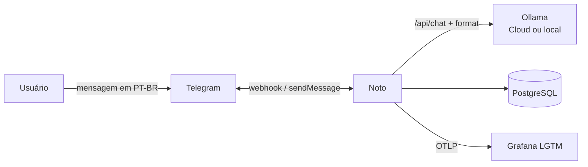
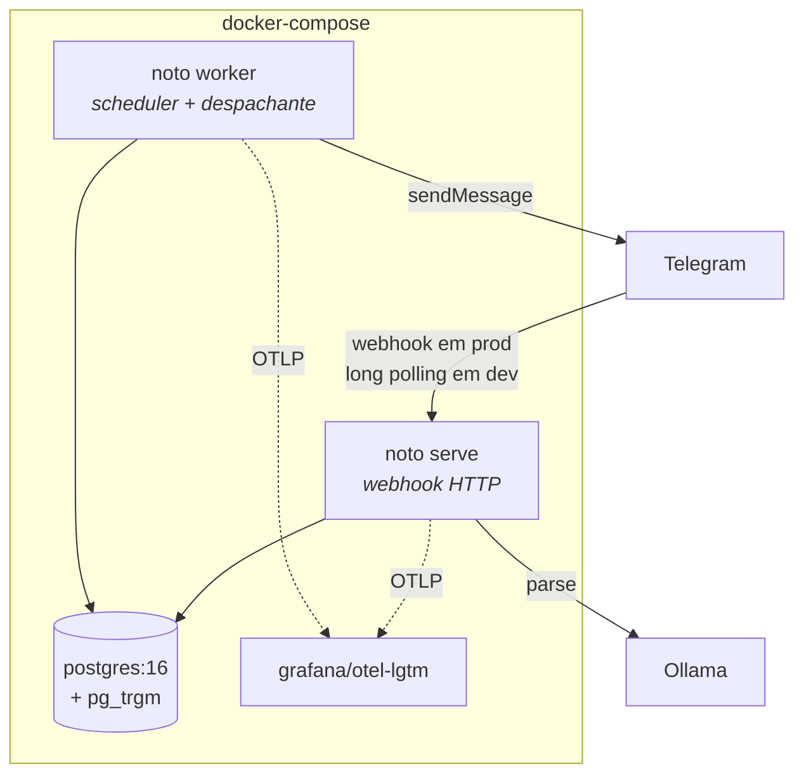
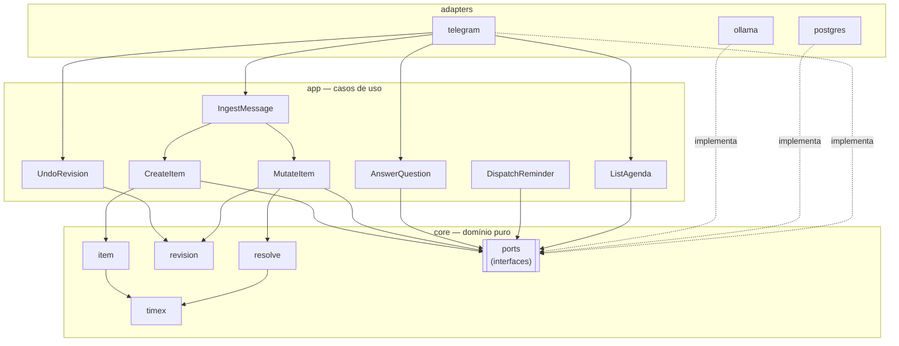
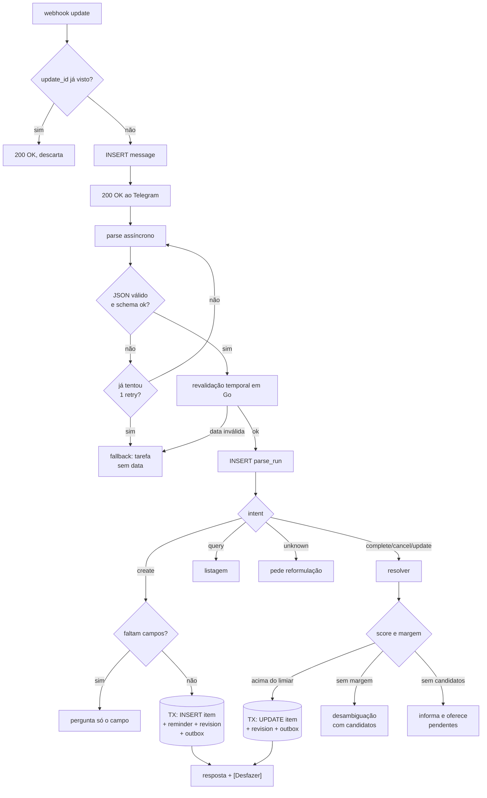
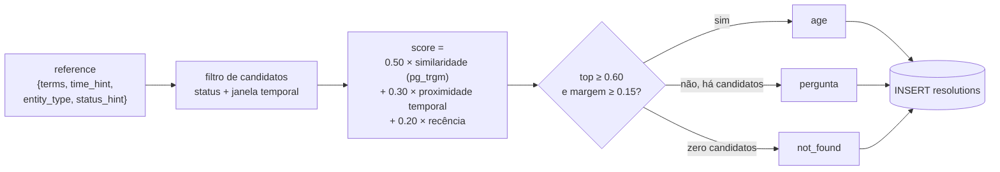
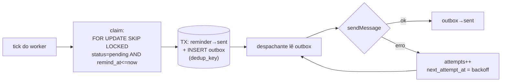

# Noto — Arquitetura

Complementa o [PRD](./PRD.md). Aqui está o *como*; lá está o *o quê* e o *por quê de produto*.

---

## 1. Contexto



O Telegram é canal de entrada e saída. O Ollama é um serviço de extração substituível. O Postgres é a única fonte de verdade — e também a fila e o índice de busca.

---

## 2. Contêineres



`serve` e `worker` são o **mesmo binário** em modos diferentes e **não conversam entre si** — toda coordenação passa pelo Postgres. Essa é a propriedade que permite escalar o worker horizontalmente ou separá-los em deploys independentes sem tocar no código.

---

## 3. Componentes internos



**Regra de dependência:** as setas de `adapters` para `core` são sempre *implementa uma interface*, nunca *importa um tipo*. `internal/core` não importa `pgx`, `telegram` nem `ollama`. Um teste de arquitetura no CI falha se isso for violado.

`core/resolve` contém a pontuação e a política de decisão da resolução de referência — é regra de negócio, e fica testável sem banco. O adapter Postgres fornece apenas candidatos e similaridade textual via `pg_trgm`.

---

## 4. Fluxo de ingestão e roteamento por intenção



O ACK ocorre em `D`, antes de qualquer chamada ao LLM. O Telegram nunca espera pela inferência.

Note que os dois caminhos que terminam em `V` **já executaram a mudança** quando a mensagem chega ao usuário. A resposta relata um fato, não propõe um. Ver [ADR 0006](./adr/0006-confirmacao-seletiva-e-desfazer.md).

---

## 5. Resolução de referência



O LLM nunca vê `item_id` e nunca escolhe o alvo — ele só descreve a referência. Toda decisão, inclusive as que não agiram, é registrada em `resolutions` com score e margem, o que torna os limiares calibráveis com dado em vez de intuição. Ver [ADR 0007](./adr/0007-resolucao-de-referencia.md).

---

## 6. Mutação e reversão

```mermaid
sequenceDiagram
    participant A as app
    participant D as PostgreSQL

    Note over A,D: mutação
    A->>D: BEGIN
    A->>D: SELECT item FOR UPDATE
    A->>D: INSERT item_revisions (before, after, action)
    A->>D: UPDATE items
    A->>D: INSERT outbox (msg + botão Desfazer com revision_id)
    A->>D: COMMIT

    Note over A,D: desfazer
    A->>D: SELECT revision
    A->>D: é a revisão mais recente do item?
    alt sim
        A->>D: TX: aplica "before" + INSERT revision (reverted)
    else não
        A-->>A: informa que o item mudou; mostra estado atual
    end
```

A mudança de estado, o snapshot que permite reverter e a mensagem ao usuário estão **na mesma transação**. Não existe estado onde o item mudou sem que haja como desfazer, nem onde o usuário foi avisado de algo que não aconteceu.

---

## 7. Fluxo de entrega de lembretes



`dedup_key` é `UNIQUE`: um retry após timeout ambíguo não gera mensagem duplicada no chat. Semântica at-least-once no envio, efeito exactly-once do ponto de vista do usuário.

---

## 8. Restrição de canal — `callback_data`

O Telegram limita `callback_data` a **64 bytes**, o que atinge os dois mecanismos centrais do MVP:

| Uso | Formato | Bytes |
|---|---|---|
| Desfazer | `u:<revision_uuid>` | 38 ✅ |
| Concluir da listagem | `d:<item_uuid>` | 38 ✅ |
| Desambiguação (ingênuo) | `q:<question_uuid>:<item_uuid>` | 75 ❌ |
| Desambiguação (adotado) | `q:<question_uuid>:<índice>` | 40 ✅ |

Os candidatos já estão ordenados em `pending_questions.candidates`, então o botão carrega apenas o índice. Efeito colateral desejável: um `callback_data` forjado não consegue apontar para um item arbitrário do banco — só para o que aquela pergunta ofereceu. A posse do item deixa de ser uma checagem e passa a ser estrutural.

Todo `callback_data` é validado contra o `user_id` da callback query antes de qualquer ação.

---

## 9. Recuperação de falha

| Falha | Comportamento |
|---|---|
| Worker morre com lembretes `claimed` | `locked_until` expira; o tick seguinte os reivindica de novo |
| API morre após `INSERT message`, antes do parse | Varredura de `messages` sem `parse_run` reprocessa |
| Telegram reentrega webhook | `telegram_update_id UNIQUE` descarta — crítico agora que a ação executa sem confirmação |
| API morre no meio de uma mutação | Transação não commitada; nada mudou, nada foi avisado |
| Ollama indisponível | Fallback de §5.5 do PRD; nada se perde |
| Resolver acerta o item errado | Nada foi destruído; `item_revisions` permite reverter a qualquer momento |
| Postgres cai | Ambos os processos falham rápido e reiniciam; nenhum estado vivia só em memória |

---

## 10. Layout do repositório

```
cmd/noto/                 serve · worker · migrate
internal/
  core/                   item · revision · resolve · timex · ports
  app/                    ingest_message · create_item · mutate_item
                          answer_question · undo_revision
                          dispatch_reminder · list_agenda
  adapters/               telegram · ollama · postgres · otel
  platform/               config · logging · http · migrations
migrations/               goose
evals/
  cases/                  golden set de extração (PT-BR)
  scenarios/              cenários de resolução de referência
docs/                     PRD · arquitetura · ADRs · eval
docker-compose.yml
Makefile
sqlc.yaml
```
